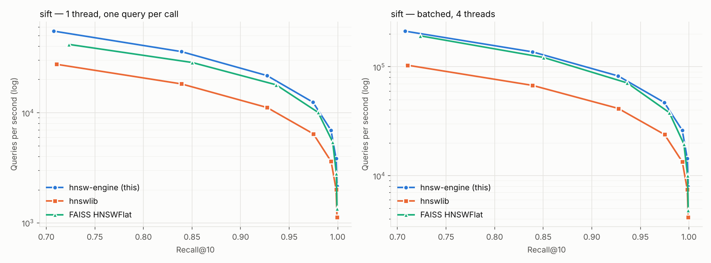

# hnsw-engine

[](https://github.com/aman-todi/hnsw-engine/actions/workflows/ci.yml)


An approximate nearest-neighbor search library written from scratch: a
Hierarchical Navigable Small World (HNSW) index in C++20, implemented from the
Malkov & Yashunin paper, with hand-written AVX2 / AVX-512 / NEON distance
kernels behind runtime CPU dispatch, a cache-friendly flat graph layout with
software prefetching, parallel build and batch search, a versioned and
checksummed on-disk format with memory-mapped loading, filtered search and soft
deletes, and a NumPy-first Python package that releases the GIL. Every
performance number below comes from a script in this repository and is
benchmarked against **hnswlib** and **FAISS `IndexHNSWFlat`** under identical
parameters.

> **Benchmarks** are on the real ann-benchmarks datasets (SIFT-1M,
> GloVe-100, GIST-1M at 200k) on an Apple M5 MacBook Pro, 4 threads. On ARM,
> FAISS is the like-for-like competitor (hnswlib has no NEON kernels); see
> [Results](#results) and [docs/BENCHMARKS.md](docs/BENCHMARKS.md).

## Architecture

```
          Python: hnsw_engine.Index  (NumPy in/out, GIL released, filters)
                              │ pybind11
 ┌────────────────────────────▼─────────────────────────────────────────────┐
 │ hnsw::Index            std::shared_mutex: searches shared, writes exclusive│
 │  build  ── Alg.1 insert + Alg.4 heuristic ── 4096 striped node locks       │
 │  search ── greedy descent ── search_layer (Alg.2) ── ScratchPool           │
 │                                     (epoch visited lists, heaps, query buf)│
 │  storage: [vectors: 64B-aligned, padded rows][layer0: count|2M ids][upper] │
 │           pointers into owned arrays *or* a read-only mmap of the file     │
 │  persist: header + 6 aligned sections, header & payload checksums          │
 ├────────────────────────────────────────────────────────────────────────────┤
 │ simd::active() → l2_sq / dot : scalar | AVX2+FMA | AVX-512 | NEON          │
 │                  (picked once via __builtin_cpu_supports; own TU per ISA)  │
 │ parallel_for   → atomic-counter work sharing for add_batch / search_batch  │
 └────────────────────────────────────────────────────────────────────────────┘
```

Details: [docs/DESIGN.md](docs/DESIGN.md) (layout, locking, dispatch),
[docs/FORMAT.md](docs/FORMAT.md) (on-disk format),
[docs/BENCHMARKS.md](docs/BENCHMARKS.md) (methodology, full results).

## Quickstart

Requirements: CMake ≥ 3.20, a C++20 compiler (GCC ≥ 11, Clang ≥ 14, AppleClang
≥ 14), Ninja, Python ≥ 3.9 with NumPy. Linux or macOS.

### Python

```bash
pip install .
```

```python
import numpy as np
import hnsw_engine

data = np.random.rand(100_000, 128).astype(np.float32)
idx = hnsw_engine.Index(dim=128, metric="l2", M=16, ef_construction=200)
idx.add(data)                                   # ids default to 0..n-1; num_threads=0 -> all cores
ids, dists = idx.search(data[:5], k=10, ef=64)  # (5, 10) int64, (5, 10) float32

idx.search(data[:5], k=10, filter=lambda label: label % 2 == 0)   # predicate
idx.search(data[:5], k=10, filter=np.arange(0, 100_000, 3))       # allow-list
idx.mark_deleted(42)

idx.save("index.bin")
ro = hnsw_engine.Index.load("index.bin", mmap=True)   # zero-copy, read-only
```

Metrics: `"l2"` (squared), `"ip"` (1 − dot), `"cosine"` (1 − cosine).

### C++

```bash
cmake --preset release && cmake --build --preset release
ctest --preset release
```

```cpp
#include "hnsw/index.hpp"

hnsw::Index index(hnsw::Params{.dim = 128, .metric = hnsw::Metric::L2, .M = 16, .ef_construction = 200});
index.add_batch(vectors, labels, n);                       // parallel
auto top10 = index.search(query, 10, /*ef=*/64);           // std::vector<Neighbor>{label, distance}

hnsw::BitsetFilter allow(n);  allow.set(7);  allow.set(99);
auto filtered = index.search(query, 10, 64, &allow);

index.save("index.bin");
auto mapped = hnsw::Index::load("index.bin", /*mmap=*/true);
```

Link against the `hnsw::engine` CMake target (`add_subdirectory` this repo).

### Reproduce a benchmark (≈ 15 minutes)

```bash
pip install numpy h5py hnswlib faiss-cpu matplotlib
python scripts/fetch_data.py sift --subset 200000      # real SIFT (500 MB download) -> data/sift-200k_*
cmake --preset bench && cmake --build --preset bench --target bench_main
./build/bench/bench/bench_main --data data --name sift-200k --nq 1000 --ef 10,20,40,80,160 --build-threads 0
HNSW_NATIVE=ON pip install .
python bench/python/compare.py --data data --name sift-200k --metric l2 --nq 1000 --reps 1
python bench/python/plot.py      # bench/results/sift-200k.png + summary.md
```

The full pipeline (all datasets, ablation, scaling, filters, plots, docs) is
`scripts/run_all_benchmarks.sh [--quick]`; `--synthetic` generates offline
stand-ins when ann-benchmarks.com is unreachable.

## Results

<!-- results:begin -->
Measured by `scripts/run_all_benchmarks.sh` on Apple M5 (4 performance + 6 efficiency cores), 10 cores, 16 GB RAM; Apple clang version 21.0.0 (clang-2100.1.1.101); hnswlib 0.8.0, faiss-cpu 1.13.0; commit `0daf0bc`. M = 16, ef_construction = 200, k = 10, 4 threads. Real ann-benchmarks datasets (SIFT-1M, GloVe-100, GIST-1M). Full tables, methodology and raw CSVs: [docs/BENCHMARKS.md](docs/BENCHMARKS.md), `bench/results/`.



**Best single-thread QPS at a recall target** (one query per Python call; bold = fastest):

| dataset | recall@10 target | hnsw-engine | hnswlib | FAISS HNSWFlat |
|---|---|---:|---:|---:|
| sift (1,000,000 × 128, l2) | ≥ 0.90 | **21,666** | 11,127 | 17,884 |
| sift (1,000,000 × 128, l2) | ≥ 0.95 | **12,414** | 6,424 | 10,062 |
| sift (1,000,000 × 128, l2) | ≥ 0.99 | **6,910** | 3,608 | 5,419 |
| glove (1,183,514 × 100, cosine) | ≥ 0.90 | 1,705 | 1,144 | **2,437** |
| gist (200,000 × 960, l2) | ≥ 0.90 | 1,685 | 770 | **2,300** |
| gist (200,000 × 960, l2) | ≥ 0.95 | 1,685 | 770 | **2,300** |
| gist (200,000 × 960, l2) | ≥ 0.99 | 559 | 263 | **680** |

**Build** (sift, 1,000,000 vectors): 42 s on 4 threads / 154 s on 1 thread, vs hnswlib 82 s / 298 s and FAISS 56 s / 198 s. Index file 628 MB (hnswlib 630, FAISS 626).

**Where the speed comes from** (sift, ef = 64):

| configuration (C++ harness, same graph) | recall@10 | QPS | vs scalar |
|---|---:|---:|---:|
| scalar kernels (no prefetch) | 0.963 | 7,830 | 1.0× |
| +NEON kernels | 0.963 | 13,878 | 1.8× |
| +prefetch | 0.963 | 15,234 | 1.9× |
| +4 search threads | 0.963 | 55,324 | 7.1× |

Distance kernel alone (L2, d = 128): scalar 26.3 ns, NEON 5.2 ns (5.0×). Parallel build: 3.8× on 4 threads (200,000 vectors: 21.0 s → 5.5 s; recall@10 at ef=64 0.9811 → 0.9810).

**Where it is slower** (every case where another library beats the engine at a target):

* glove, single-thread, recall ≥ 0.90: 1,705 vs FAISS HNSWFlat 2,437 QPS (-30%)
* glove, batched, recall ≥ 0.90: 6,266 vs FAISS HNSWFlat 8,931 QPS (-30%)
* gist, single-thread, recall ≥ 0.90: 1,685 vs FAISS HNSWFlat 2,300 QPS (-27%)
* gist, single-thread, recall ≥ 0.95: 1,685 vs FAISS HNSWFlat 2,300 QPS (-27%)
* gist, single-thread, recall ≥ 0.99: 559 vs FAISS HNSWFlat 680 QPS (-18%)

**On ARM (this run): hnswlib ships hand-written SIMD distance kernels only for x86 (SSE/AVX), so on Apple Silicon its distances use the compiler's generic code path; part of the gap to hnswlib reflects that. FAISS has NEON kernels and is the like-for-like comparison on this machine.**
<!-- results:end -->

## Testing and quality

* **C++ (GoogleTest, 54 tests):** every kernel vs the scalar reference for all
  dims 1–1024 (aligned and misaligned); recall vs a brute-force oracle for
  several dims and all metrics; edge cases (empty index, k > size, ef < k,
  duplicate labels, dim = 1, identical vectors); seed determinism; growth and
  capacity limits; save/load round trips in both modes; truncation and
  bit-flip fuzzing of the file format; filter correctness on a selectivity
  sweep; soft delete; concurrent `search_batch` and readers racing writers.
* **Python (pytest, 28 tests):** dtype / shape / contiguity handling, id
  handling, filters (callable, mask, id list), exceptions from callbacks,
  save/load, exact result parity with the C++ harness, determinism, GIL
  release and concurrent searches from Python threads.
* **Sanitizers:** the full C++ suite runs clean under ASan + UBSan and under
  ThreadSanitizer (presets `asan`, `tsan`).
* **CI:** GCC and Clang on Ubuntu, AppleClang on macOS (arm64 → NEON),
  ASan/UBSan, TSan, wheel build + pytest in a clean venv, clang-format check,
  and a smoke benchmark.

## Limitations

* The published benchmark is one machine (Apple M5, 4 performance cores) and
  one parameter setting (M = 16, ef_construction = 200). On ARM, hnswlib runs
  without hand-written SIMD, which flatters the engine's lead over it; FAISS
  is faster than the engine on GloVe-100 and GIST (see Results).
* GloVe-100 at M = 16 tops out around recall@10 = 0.94 for all three
  libraries even at ef = 640; higher recall needs a larger M.
* Index updates are append + soft delete only; deleted nodes stay in the graph
  and their space is never reclaimed.
* Inserts and searches do not overlap: mutations take an exclusive lock and
  wait for in-flight searches.
* `uint32` internal ids: at most ~4.29 billion vectors per index.
* Very selective filters (≈1% of labels allowed) cost noticeably more work
  and recall drops at a fixed ef (see BENCHMARKS.md).
* Max inner product on un-normalized data is harder for HNSW than L2/cosine
  (this affects all three libraries).
* POSIX only (mmap); no Windows build.
* Python labels are int64; labels ≥ 2⁶³ are not representable from Python.

## License

MIT — see [LICENSE](LICENSE).
