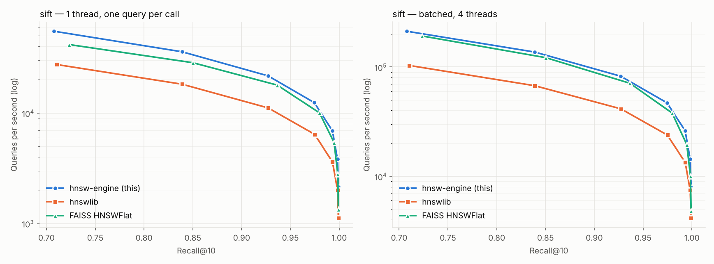
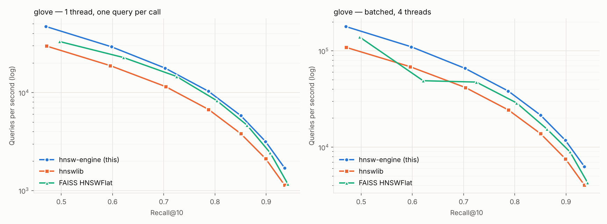
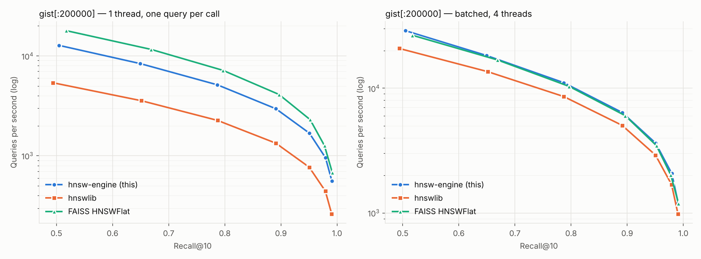
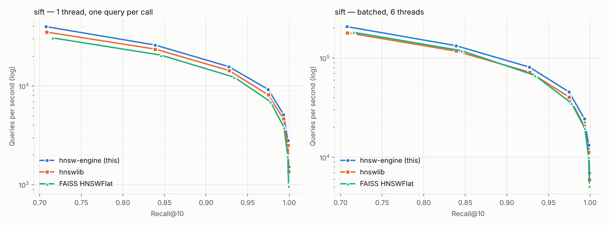
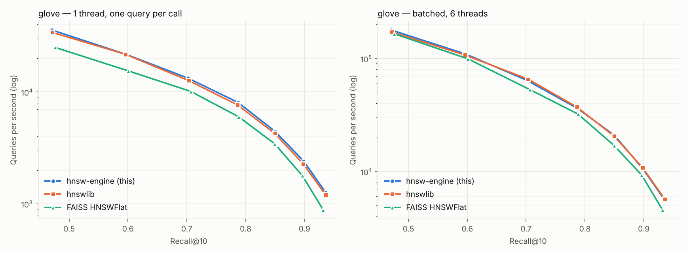
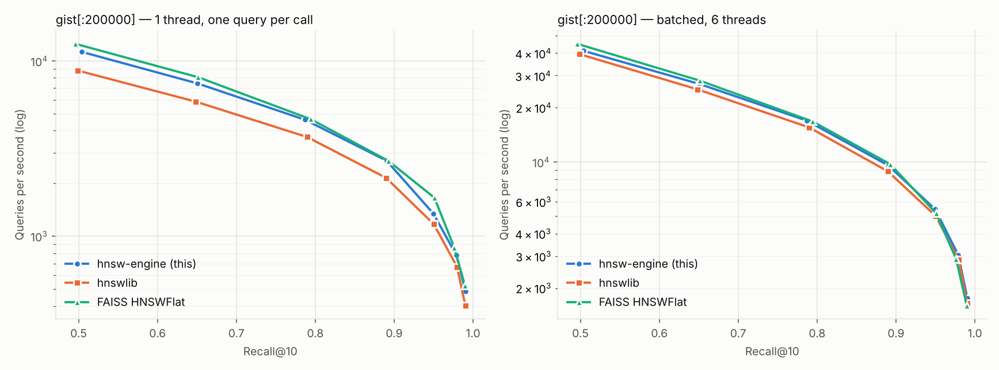

# Benchmarks

All numbers in this document were produced by `scripts/run_all_benchmarks.sh`
and are rendered from the CSVs in `bench/results/<machine>/` by `bench/python/report.py`
(raw rows, plots and the generated `summary.md` live there). Nothing here was
typed in by hand.

## Data

The real [ann-benchmarks](https://github.com/erikbern/ann-benchmarks) HDF5
files, downloaded and converted by `scripts/fetch_data.py` (SHA-256 printed on
download):

| dataset | dim | base | queries | metric | ground truth |
|---|---:|---:|---:|---|---|
| SIFT-1M | 128 | 1,000,000 | 10,000 | L2 | provided top-100 |
| GloVe-100 | 100 | 1,183,514 | 10,000 | cosine (angular) | provided top-100 |
| GIST-1M | 960 | 200,000 of 1,000,000 | 1,000 | L2 | recomputed exactly for the subset (NumPy) |

GIST runs on its first 200k vectors (`GIST_SUBSET`) so three 960-d indexes fit
comfortably in 16 GB of RAM; set `GIST_SUBSET=0` on a larger machine.

### Earlier synthetic run

Before the real files were reachable, the pipeline was developed and run on
synthetic stand-ins of the same shapes (`--synthetic`, Gaussian mixtures on
low-dimensional subspaces) on a 4-core Intel Xeon cloud VM with AVX-512. Those
raw CSVs and plots are kept in `bench/results/synthetic-xeon-vm/` for reference but are not
used in the tables below. One observation from that run, a slightly lower
high-recall ceiling than hnswlib on synthetic SIFT, does **not** reproduce on
real SIFT-1M (max recall 0.9993 vs hnswlib 0.9992).

## Setup

Each machine's exact hardware, compiler and library versions are in its own
`environment.txt` (shown at the top of its section under Results). Methodology
is identical on every machine:

* Engine built with `-O3` and `-march=native` (x86) / `-mcpu=native` (ARM):
  the `bench` preset for the C++ harness, `HNSW_NATIVE=ON pip install .` for
  the Python package. hnswlib 0.8.0 is compiled locally with its default flags;
  its hand-written SIMD kernels are x86-only (SSE/AVX), so **on ARM it runs its
  generic distance code and FAISS (which has NEON kernels) is the like-for-like
  comparison**. On x86 all three libraries use AVX2/AVX-512 kernels.
* All libraries: `M = 16`, `ef_construction = 200`, `k = 10`, same metric
  (FAISS cosine = inner product on normalized vectors, which is how the other
  two implement cosine internally), same thread count (FAISS via
  `omp_set_num_threads`). The thread count per machine is in its environment
  block; on hybrid CPUs it is the number of performance cores.
* Every library runs in its own subprocess (`compare.py`), so peak memory is
  isolated per library.
* Search comparisons use a pre-built index (standard ann-benchmarks method):
  build once, then sweep `ef_search ∈ {10, 20, 40, 80, 160, 320, 640}`.
* Two query modes: **single**: one thread, one query per Python call
  (per-query latency p50/p95/p99, includes the Python call overhead for every
  library alike); **batch**: all queries in one call on all benchmark threads
  (throughput). Each point: warm-up pass, then 3 repetitions, median by QPS.
* Recall@10 = |returned ∩ true top-10| / 10, averaged over queries (id
  overlap). SIFT vectors are integer-valued, so exact distance ties occur and
  a correct neighbour can occasionally count as a miss; this is why brute
  force scores 0.9991 rather than 1.0 against the provided ground truth.
* **QPS at a recall target** is read off each library's recall-vs-QPS curve:
  between the two `ef` points that bracket the target, log(QPS) is
  interpolated linearly in recall. Taking the best measured point at
  recall ≥ target instead makes a library look up to ~40% slower whenever
  its curve lands just below the threshold (e.g. 0.9497 vs 0.95).
* Build metrics: wall time with all benchmark threads and with 1 thread
  (SIFT), peak RSS of the process and serialized index size. "RSS growth" is
  shown as "—" for the Apple M5 run: on macOS the harness at that commit
  recorded peak instead of current RSS (fixed since; `compare.py` now asks
  `ps`, recorded as `rss_growth: ps` in `environment.txt`).
* Throughput on a laptop depends on thermals and background load; each run
  was made plugged in, with other applications closed, in a single pass.
  The WSL2 run goes through a Hyper-V VM, which costs a few percent against
  bare-metal Linux for all three libraries alike.

## Results

<!-- results:begin -->
### Apple M5

```
commit: 0daf0bc3ff2198cb690d3df9e23b2a754307e929
date: 2026-10-09T00:33Z
cpu: Apple M5 (4 performance + 6 efficiency cores)
cores: 10 (threads used: 4)
memory: 16 GB
os: Darwin 25.6.0 arm64
compiler: Apple clang version 21.0.0 (clang-2100.1.1.101)
python: Python 3.9.6
hnswlib: 0.8.0
faiss-cpu: 1.13.0
numpy: 2.0.2
engine simd: neon
```

Every multi-threaded step used 4 threads. On this machine hnswlib ships hand-written SIMD kernels only for x86, so on this ARM machine its distances run the compiler's generic code; FAISS (NEON kernels) is the like-for-like comparison here.





#### gist

n=200000, dim=960, metric=l2, M=16, ef_construction=200, k=10, threads=4

**QPS at recall@10 target (single-thread, one query per call; interpolated on the recall-QPS curve)**

| library | 0.90 | 0.95 | 0.99 |
|---|---:|---:|---:|
| hnsw-engine (this) | 2,715 | 1,696 | 581 |
| hnswlib | 1,230 | 773 | 268 |
| FAISS HNSWFlat | 3,959 | 2,348 | 727 |

**QPS at recall@10 target (batched, multi-thread; interpolated on the recall-QPS curve)**

| library | 0.90 | 0.95 | 0.99 |
|---|---:|---:|---:|
| hnsw-engine (this) | 5,861 | 3,650 | 1,251 |
| hnswlib | 4,630 | 2,921 | 1,003 |
| FAISS HNSWFlat | 5,813 | 3,537 | 1,259 |

**Recall / QPS / latency per ef (single-thread)**

| library | ef | recall@10 | QPS | p50 µs | p99 µs |
|---|---:|---:|---:|---:|---:|
| hnsw-engine (this) | 10 | 0.5048 | 12,699 | 77 | 128 |
| hnsw-engine (this) | 20 | 0.6494 | 8,351 | 119 | 181 |
| hnsw-engine (this) | 40 | 0.7869 | 5,120 | 200 | 268 |
| hnsw-engine (this) | 80 | 0.8910 | 2,955 | 352 | 437 |
| hnsw-engine (this) | 160 | 0.9507 | 1,685 | 618 | 777 |
| hnsw-engine (this) | 320 | 0.9794 | 957 | 1,091 | 1,355 |
| hnsw-engine (this) | 640 | 0.9908 | 559 | 1,864 | 2,341 |
| hnswlib | 10 | 0.4940 | 5,373 | 184 | 290 |
| hnswlib | 20 | 0.6515 | 3,554 | 280 | 430 |
| hnswlib | 40 | 0.7871 | 2,259 | 455 | 617 |
| hnswlib | 80 | 0.8909 | 1,338 | 778 | 971 |
| hnswlib | 160 | 0.9504 | 770 | 1,351 | 1,680 |
| hnswlib | 320 | 0.9791 | 444 | 2,344 | 2,946 |
| hnswlib | 640 | 0.9904 | 263 | 3,978 | 4,986 |
| FAISS HNSWFlat | 10 | 0.5175 | 17,831 | 55 | 88 |
| FAISS HNSWFlat | 20 | 0.6687 | 11,578 | 86 | 130 |
| FAISS HNSWFlat | 40 | 0.7966 | 7,153 | 142 | 187 |
| FAISS HNSWFlat | 80 | 0.8965 | 4,106 | 252 | 316 |
| FAISS HNSWFlat | 160 | 0.9520 | 2,300 | 452 | 541 |
| FAISS HNSWFlat | 320 | 0.9776 | 1,263 | 821 | 985 |
| FAISS HNSWFlat | 640 | 0.9915 | 680 | 1,522 | 1,814 |

**Build**

| library | version | build s (N threads) | build s (1 thread) | index file MB | RSS growth MB | peak RSS MB |
|---|---|---:|---:|---:|---:|---:|
| hnsw-engine (this) | 0.1.0 | 54.7 | — | 760 | — | 1528 |
| hnswlib | 0.8.0 | 82.8 | — | 761 | — | 1557 |
| FAISS HNSWFlat | 1.13.0 | 59.6 | — | 760 | — | 1572 |

#### glove

n=1183514, dim=100, metric=cosine, M=16, ef_construction=200, k=10, threads=4

**QPS at recall@10 target (single-thread, one query per call; interpolated on the recall-QPS curve)**

| library | 0.90 | 0.95 | 0.99 |
|---|---:|---:|---:|
| hnsw-engine (this) | 3,106 | — | — |
| hnswlib | 2,082 | — | — |
| FAISS HNSWFlat | 2,719 | — | — |

**QPS at recall@10 target (batched, multi-thread; interpolated on the recall-QPS curve)**

| library | 0.90 | 0.95 | 0.99 |
|---|---:|---:|---:|
| hnsw-engine (this) | 11,512 | — | — |
| hnswlib | 7,411 | — | — |
| FAISS HNSWFlat | 9,798 | — | — |

**Recall / QPS / latency per ef (single-thread)**

| library | ef | recall@10 | QPS | p50 µs | p99 µs |
|---|---:|---:|---:|---:|---:|
| hnsw-engine (this) | 10 | 0.4699 | 46,890 | 20 | 38 |
| hnsw-engine (this) | 20 | 0.5979 | 29,153 | 32 | 62 |
| hnsw-engine (this) | 40 | 0.7025 | 17,702 | 54 | 96 |
| hnsw-engine (this) | 80 | 0.7871 | 10,295 | 96 | 159 |
| hnsw-engine (this) | 160 | 0.8505 | 5,810 | 174 | 255 |
| hnsw-engine (this) | 320 | 0.8988 | 3,170 | 322 | 431 |
| hnsw-engine (this) | 640 | 0.9360 | 1,705 | 600 | 790 |
| hnswlib | 10 | 0.4709 | 29,669 | 32 | 61 |
| hnswlib | 20 | 0.5955 | 18,750 | 51 | 96 |
| hnswlib | 40 | 0.7036 | 11,466 | 84 | 152 |
| hnswlib | 80 | 0.7875 | 6,715 | 147 | 239 |
| hnswlib | 160 | 0.8504 | 3,809 | 265 | 392 |
| hnswlib | 320 | 0.8990 | 2,117 | 484 | 646 |
| hnswlib | 640 | 0.9358 | 1,144 | 895 | 1,168 |
| FAISS HNSWFlat | 10 | 0.4966 | 32,959 | 29 | 49 |
| FAISS HNSWFlat | 20 | 0.6210 | 22,696 | 42 | 72 |
| FAISS HNSWFlat | 40 | 0.7247 | 14,564 | 66 | 110 |
| FAISS HNSWFlat | 80 | 0.8035 | 8,263 | 119 | 188 |
| FAISS HNSWFlat | 160 | 0.8625 | 4,655 | 215 | 301 |
| FAISS HNSWFlat | 320 | 0.9076 | 2,437 | 415 | 534 |
| FAISS HNSWFlat | 640 | 0.9421 | 1,175 | 858 | 1,056 |

**Build**

| library | version | build s (N threads) | build s (1 thread) | index file MB | RSS growth MB | peak RSS MB |
|---|---|---:|---:|---:|---:|---:|
| hnsw-engine (this) | 0.1.0 | 65.6 | — | 671 | — | 1270 |
| hnswlib | 0.8.0 | 108.7 | — | 619 | — | 1282 |
| FAISS HNSWFlat | 1.13.0 | 96.3 | — | 614 | — | 1798 |

#### sift

n=1000000, dim=128, metric=l2, M=16, ef_construction=200, k=10, threads=4

**QPS at recall@10 target (single-thread, one query per call; interpolated on the recall-QPS curve)**

| library | 0.90 | 0.95 | 0.99 |
|---|---:|---:|---:|
| hnsw-engine (this) | 25,282 | 16,570 | 7,623 |
| hnswlib | 12,957 | 8,559 | 3,989 |
| FAISS HNSWFlat | 21,768 | 14,943 | 6,596 |

**QPS at recall@10 target (batched, multi-thread; interpolated on the recall-QPS curve)**

| library | 0.90 | 0.95 | 0.99 |
|---|---:|---:|---:|
| hnsw-engine (this) | 96,284 | 62,819 | 28,804 |
| hnswlib | 48,130 | 31,810 | 14,795 |
| FAISS HNSWFlat | 89,192 | 58,365 | 24,104 |

**Recall / QPS / latency per ef (single-thread)**

| library | ef | recall@10 | QPS | p50 µs | p99 µs |
|---|---:|---:|---:|---:|---:|
| hnsw-engine (this) | 10 | 0.7077 | 54,808 | 18 | 29 |
| hnsw-engine (this) | 20 | 0.8390 | 35,743 | 28 | 42 |
| hnsw-engine (this) | 40 | 0.9272 | 21,666 | 47 | 65 |
| hnsw-engine (this) | 80 | 0.9746 | 12,414 | 83 | 106 |
| hnsw-engine (this) | 160 | 0.9931 | 6,910 | 150 | 190 |
| hnsw-engine (this) | 320 | 0.9983 | 3,829 | 272 | 348 |
| hnsw-engine (this) | 640 | 0.9993 | 2,151 | 483 | 633 |
| hnswlib | 10 | 0.7104 | 27,433 | 36 | 60 |
| hnswlib | 20 | 0.8390 | 18,216 | 55 | 84 |
| hnswlib | 40 | 0.9273 | 11,127 | 92 | 126 |
| hnswlib | 80 | 0.9749 | 6,424 | 162 | 206 |
| hnswlib | 160 | 0.9932 | 3,608 | 289 | 368 |
| hnswlib | 320 | 0.9983 | 2,012 | 518 | 669 |
| hnswlib | 640 | 0.9992 | 1,129 | 923 | 1,222 |
| FAISS HNSWFlat | 10 | 0.7232 | 41,544 | 24 | 36 |
| FAISS HNSWFlat | 20 | 0.8501 | 28,472 | 35 | 51 |
| FAISS HNSWFlat | 40 | 0.9365 | 17,884 | 57 | 75 |
| FAISS HNSWFlat | 80 | 0.9797 | 10,062 | 102 | 127 |
| FAISS HNSWFlat | 160 | 0.9948 | 5,419 | 190 | 234 |
| FAISS HNSWFlat | 320 | 0.9986 | 2,795 | 368 | 451 |
| FAISS HNSWFlat | 640 | 0.9992 | 1,342 | 762 | 920 |

**Build**

| library | version | build s (N threads) | build s (1 thread) | index file MB | RSS growth MB | peak RSS MB |
|---|---|---:|---:|---:|---:|---:|
| hnsw-engine (this) | 0.1.0 | 42.5 | 153.8 | 628 | — | 1248 |
| hnswlib | 0.8.0 | 82.2 | 298.2 | 630 | — | 1310 |
| FAISS HNSWFlat | 1.13.0 | 56.3 | 198.0 | 626 | — | 1347 |

#### Ablation (bench_main, engine only)

| label | isa | prefetch | search_threads | ef | recall | qps | p50_us | p99_us |
|---|---|---|---|---|---|---|---|---|
| 1 scalar kernels (no prefetch) | scalar | 0 | 1 | 64 | 0.96344 | 7829.9 | 132.0 | 171.1 |
| 2 +NEON kernels | neon | 0 | 1 | 64 | 0.96344 | 13877.9 | 74.2 | 95.8 |
| 3 +prefetch | neon | 1 | 1 | 64 | 0.96344 | 15234.0 | 67.7 | 87.6 |
| 5 +4 search threads | neon | 1 | 4 | 64 | 0.96344 | 55323.7 | nan | nan |

#### Build thread scaling (bench_main, engine only)

| build_threads | n | build_s | ef | recall |
|---|---|---|---|---|
| 1 | 200000 | 20.985 | 64 | 0.98110 |
| 2 | 200000 | 10.652 | 64 | 0.98080 |
| 4 | 200000 | 5.525 | 64 | 0.98100 |

Brute force on SIFT-1M (1,000 queries) reaches recall 0.99910 against the provided ground truth (`bruteforce.csv`); anything below 1.0 is exact distance ties in the integer-valued SIFT vectors, where either tied neighbour is correct.

#### Filtered search (engine, sift[:200000], random allow-lists)

| allowed | ef | recall@10 | QPS | filter violations |
|---:|---:|---:|---:|---:|
| 1% | 40 | 1.0000 | 2,893 | 0 |
| 1% | 80 | 1.0000 | 1,632 | 0 |
| 1% | 160 | 1.0000 | 936 | 0 |
| 1% | 320 | 1.0000 | 538 | 0 |
| 10% | 40 | 0.9984 | 17,597 | 0 |
| 10% | 80 | 0.9999 | 10,227 | 0 |
| 10% | 160 | 1.0000 | 5,860 | 0 |
| 10% | 320 | 1.0000 | 3,392 | 0 |
| 50% | 40 | 0.9818 | 59,612 | 0 |
| 50% | 80 | 0.9967 | 33,557 | 0 |
| 50% | 160 | 0.9997 | 19,487 | 0 |
| 50% | 320 | 0.9999 | 11,272 | 0 |
| 90% | 40 | 0.9596 | 93,512 | 0 |
| 90% | 80 | 0.9902 | 56,005 | 0 |
| 90% | 160 | 0.9977 | 30,450 | 0 |
| 90% | 320 | 0.9996 | 17,659 | 0 |

#### Kernel microbenchmarks (Google Benchmark, ns per call)

| dim | scalar L2 | NEON L2 | scalar dot | NEON dot |
|---:|---:|---:|---:|---:|
| 16 | 2.2 | 1.4 | 1.8 | 1.2 |
| 100 | 17.6 | 4.3 | 16.4 | 4.1 |
| 128 | 26.3 | 5.2 | 22.9 | 5.2 |
| 384 | 112.5 | 15.7 | 108.2 | 15.1 |
| 768 | 288.9 | 33.4 | 277.9 | 31.0 |
| 960 | 381.2 | 42.3 | 374.1 | 39.4 |
| 1024 | 410.4 | 46.0 | 417.1 | 43.8 |

### Intel i7-13800H (WSL2)

```
commit: b45cca4a47536ba9bf56b9fbfa9badb129eb0758
date: 2026-10-09T16:00Z
cpu: 13th Gen Intel(R) Core(TM) i7-13800H
cores: 20 (threads used: 6)
memory: 15 GB
os: Linux 6.18.40.1-microsoft-standard-WSL2 x86_64
rss_growth: proc
compiler: c++ (Ubuntu 13.3.0-6ubuntu2~24.04.1) 13.3.0
python: Python 3.12.3
hnswlib: 0.8.0
faiss-cpu: 1.15.1
numpy: 2.5.3
engine simd: avx2
```

Every multi-threaded step used 6 threads. On this machine all three libraries use hand-written x86 SIMD kernels here (engine: AVX2), so this is the like-for-like three-way comparison.





#### gist

n=200000, dim=960, metric=l2, M=16, ef_construction=200, k=10, threads=6

**QPS at recall@10 target (single-thread, one query per call; interpolated on the recall-QPS curve)**

| library | 0.90 | 0.95 | 0.99 |
|---|---:|---:|---:|
| hnsw-engine (this) | 2,410 | 1,341 | 496 |
| hnswlib | 1,944 | 1,176 | 408 |
| FAISS HNSWFlat | 2,533 | 1,674 | — |

**QPS at recall@10 target (batched, multi-thread; interpolated on the recall-QPS curve)**

| library | 0.90 | 0.95 | 0.99 |
|---|---:|---:|---:|
| hnsw-engine (this) | 8,716 | 5,430 | 1,801 |
| hnswlib | 8,044 | 5,032 | 1,668 |
| FAISS HNSWFlat | 8,974 | 5,241 | — |

**Recall / QPS / latency per ef (single-thread)**

| library | ef | recall@10 | QPS | p50 µs | p99 µs |
|---|---:|---:|---:|---:|---:|
| hnsw-engine (this) | 10 | 0.5037 | 11,245 | 86 | 179 |
| hnsw-engine (this) | 20 | 0.6504 | 7,438 | 130 | 252 |
| hnsw-engine (this) | 40 | 0.7869 | 4,616 | 216 | 387 |
| hnsw-engine (this) | 80 | 0.8903 | 2,700 | 371 | 629 |
| hnsw-engine (this) | 160 | 0.9497 | 1,348 | 759 | 1,150 |
| hnsw-engine (this) | 320 | 0.9788 | 782 | 1,317 | 1,755 |
| hnsw-engine (this) | 640 | 0.9905 | 486 | 2,089 | 3,245 |
| hnswlib | 10 | 0.4992 | 8,792 | 106 | 218 |
| hnswlib | 20 | 0.6485 | 5,852 | 165 | 316 |
| hnswlib | 40 | 0.7896 | 3,681 | 271 | 425 |
| hnswlib | 80 | 0.8898 | 2,154 | 466 | 713 |
| hnswlib | 160 | 0.9504 | 1,171 | 886 | 1,200 |
| hnswlib | 320 | 0.9797 | 670 | 1,542 | 2,104 |
| hnswlib | 640 | 0.9902 | 404 | 2,546 | 3,670 |
| FAISS HNSWFlat | 10 | 0.4957 | 12,498 | 76 | 157 |
| FAISS HNSWFlat | 20 | 0.6514 | 8,062 | 119 | 254 |
| FAISS HNSWFlat | 40 | 0.7943 | 4,648 | 212 | 350 |
| FAISS HNSWFlat | 80 | 0.8928 | 2,688 | 376 | 524 |
| FAISS HNSWFlat | 160 | 0.9510 | 1,660 | 607 | 923 |
| FAISS HNSWFlat | 320 | 0.9762 | 864 | 1,150 | 2,356 |
| FAISS HNSWFlat | 640 | 0.9897 | 525 | 1,934 | 2,818 |

**Build**

| library | version | build s (N threads) | build s (1 thread) | index file MB | RSS growth MB | peak RSS MB |
|---|---|---:|---:|---:|---:|---:|
| hnsw-engine (this) | 0.1.0 | 38.5 | — | 760 | 774 | 3073 |
| hnswlib | 0.8.0 | 41.2 | — | 761 | 786 | 3073 |
| FAISS HNSWFlat | 1.15.1 | 41.9 | — | 760 | 778 | 3073 |

#### glove

n=1183514, dim=100, metric=cosine, M=16, ef_construction=200, k=10, threads=6

**QPS at recall@10 target (single-thread, one query per call; interpolated on the recall-QPS curve)**

| library | 0.90 | 0.95 | 0.99 |
|---|---:|---:|---:|
| hnsw-engine (this) | 2,363 | — | — |
| hnswlib | 2,211 | — | — |
| FAISS HNSWFlat | 1,672 | — | — |

**QPS at recall@10 target (batched, multi-thread; interpolated on the recall-QPS curve)**

| library | 0.90 | 0.95 | 0.99 |
|---|---:|---:|---:|
| hnsw-engine (this) | 10,303 | — | — |
| hnswlib | 10,447 | — | — |
| FAISS HNSWFlat | 8,659 | — | — |

**Recall / QPS / latency per ef (single-thread)**

| library | ef | recall@10 | QPS | p50 µs | p99 µs |
|---|---:|---:|---:|---:|---:|
| hnsw-engine (this) | 10 | 0.4708 | 35,664 | 26 | 56 |
| hnsw-engine (this) | 20 | 0.5976 | 21,572 | 42 | 93 |
| hnsw-engine (this) | 40 | 0.7022 | 13,264 | 69 | 137 |
| hnsw-engine (this) | 80 | 0.7872 | 8,059 | 120 | 228 |
| hnsw-engine (this) | 160 | 0.8502 | 4,440 | 222 | 415 |
| hnsw-engine (this) | 320 | 0.8987 | 2,416 | 415 | 660 |
| hnsw-engine (this) | 640 | 0.9361 | 1,268 | 799 | 1,175 |
| hnswlib | 10 | 0.4714 | 33,952 | 27 | 58 |
| hnswlib | 20 | 0.5961 | 21,659 | 43 | 89 |
| hnswlib | 40 | 0.7034 | 12,620 | 73 | 154 |
| hnswlib | 80 | 0.7863 | 7,663 | 125 | 238 |
| hnswlib | 160 | 0.8498 | 4,260 | 230 | 394 |
| hnswlib | 320 | 0.8981 | 2,283 | 438 | 738 |
| hnswlib | 640 | 0.9359 | 1,211 | 836 | 1,268 |
| FAISS HNSWFlat | 10 | 0.4759 | 24,978 | 37 | 84 |
| FAISS HNSWFlat | 20 | 0.6008 | 15,409 | 60 | 132 |
| FAISS HNSWFlat | 40 | 0.7065 | 10,130 | 92 | 186 |
| FAISS HNSWFlat | 80 | 0.7883 | 6,002 | 159 | 296 |
| FAISS HNSWFlat | 160 | 0.8496 | 3,442 | 284 | 488 |
| FAISS HNSWFlat | 320 | 0.8964 | 1,797 | 552 | 878 |
| FAISS HNSWFlat | 640 | 0.9317 | 890 | 1,124 | 1,598 |

**Build**

| library | version | build s (N threads) | build s (1 thread) | index file MB | RSS growth MB | peak RSS MB |
|---|---|---:|---:|---:|---:|---:|
| hnsw-engine (this) | 0.1.0 | 69.6 | — | 671 | 742 | 1241 |
| hnswlib | 0.8.0 | 80.8 | — | 619 | 741 | 1250 |
| FAISS HNSWFlat | 1.15.1 | 88.3 | — | 614 | 654 | 1603 |

#### sift

n=1000000, dim=128, metric=l2, M=16, ef_construction=200, k=10, threads=6

**QPS at recall@10 target (single-thread, one query per call; interpolated on the recall-QPS curve)**

| library | 0.90 | 0.95 | 0.99 |
|---|---:|---:|---:|
| hnsw-engine (this) | 18,269 | 12,122 | 5,663 |
| hnswlib | 16,689 | 10,915 | 5,081 |
| FAISS HNSWFlat | 14,892 | 9,884 | 4,332 |

**QPS at recall@10 target (batched, multi-thread; interpolated on the recall-QPS curve)**

| library | 0.90 | 0.95 | 0.99 |
|---|---:|---:|---:|
| hnsw-engine (this) | 94,158 | 61,241 | 27,122 |
| hnswlib | 83,528 | 54,557 | 23,050 |
| FAISS HNSWFlat | 83,010 | 52,495 | 22,298 |

**Recall / QPS / latency per ef (single-thread)**

| library | ef | recall@10 | QPS | p50 µs | p99 µs |
|---|---:|---:|---:|---:|---:|
| hnsw-engine (this) | 10 | 0.7077 | 39,730 | 24 | 48 |
| hnsw-engine (this) | 20 | 0.8387 | 25,880 | 37 | 82 |
| hnsw-engine (this) | 40 | 0.9271 | 15,660 | 62 | 110 |
| hnsw-engine (this) | 80 | 0.9746 | 9,200 | 109 | 176 |
| hnsw-engine (this) | 160 | 0.9931 | 5,137 | 196 | 346 |
| hnsw-engine (this) | 320 | 0.9983 | 2,796 | 363 | 556 |
| hnsw-engine (this) | 640 | 0.9993 | 1,527 | 665 | 1,051 |
| hnswlib | 10 | 0.7082 | 34,986 | 27 | 54 |
| hnswlib | 20 | 0.8389 | 23,537 | 42 | 73 |
| hnswlib | 40 | 0.9275 | 14,294 | 70 | 111 |
| hnswlib | 80 | 0.9747 | 8,117 | 124 | 184 |
| hnswlib | 160 | 0.9931 | 4,624 | 221 | 316 |
| hnswlib | 320 | 0.9983 | 2,507 | 409 | 571 |
| hnswlib | 640 | 0.9992 | 1,363 | 753 | 1,070 |
| FAISS HNSWFlat | 10 | 0.7157 | 30,548 | 31 | 69 |
| FAISS HNSWFlat | 20 | 0.8457 | 20,461 | 47 | 90 |
| FAISS HNSWFlat | 40 | 0.9337 | 12,230 | 80 | 134 |
| FAISS HNSWFlat | 80 | 0.9775 | 6,900 | 142 | 269 |
| FAISS HNSWFlat | 160 | 0.9936 | 3,786 | 265 | 445 |
| FAISS HNSWFlat | 320 | 0.9982 | 1,949 | 519 | 778 |
| FAISS HNSWFlat | 640 | 0.9992 | 975 | 1,041 | 1,511 |

**Build**

| library | version | build s (N threads) | build s (1 thread) | index file MB | RSS growth MB | peak RSS MB |
|---|---|---:|---:|---:|---:|---:|
| hnsw-engine (this) | 0.1.0 | 45.2 | 211.6 | 628 | 632 | 1226 |
| hnswlib | 0.8.0 | 57.2 | 263.9 | 630 | 728 | 1293 |
| FAISS HNSWFlat | 1.15.1 | 67.0 | 320.1 | 626 | 640 | 1193 |

#### Ablation (bench_main, engine only)

| label | isa | prefetch | search_threads | ef | recall | qps | p50_us | p99_us |
|---|---|---|---|---|---|---|---|---|
| 1 scalar kernels (no prefetch) | scalar | 0 | 1 | 64 | 0.96337 | 4287.5 | 233.7 | 405.3 |
| 2 +AVX2 kernels | avx2 | 0 | 1 | 64 | 0.96337 | 10007.1 | 98.6 | 162.8 |
| 3 +prefetch | avx2 | 1 | 1 | 64 | 0.96337 | 12078.1 | 82.7 | 143.2 |
| 5 +6 search threads | avx2 | 1 | 6 | 64 | 0.96337 | 55904.8 | nan | nan |

#### Build thread scaling (bench_main, engine only)

| build_threads | n | build_s | ef | recall |
|---|---|---|---|---|
| 1 | 200000 | 28.827 | 64 | 0.98110 |
| 2 | 200000 | 14.240 | 64 | 0.98100 |
| 4 | 200000 | 8.055 | 64 | 0.98060 |

Brute force on SIFT-1M (1,000 queries) reaches recall 0.99910 against the provided ground truth (`bruteforce.csv`); anything below 1.0 is exact distance ties in the integer-valued SIFT vectors, where either tied neighbour is correct.

#### Filtered search (engine, sift[:200000], random allow-lists)

| allowed | ef | recall@10 | QPS | filter violations |
|---:|---:|---:|---:|---:|
| 1% | 40 | 0.9990 | 2,138 | 0 |
| 1% | 80 | 0.9990 | 1,255 | 0 |
| 1% | 160 | 0.9990 | 684 | 0 |
| 1% | 320 | 0.9990 | 373 | 0 |
| 10% | 40 | 0.9982 | 16,717 | 0 |
| 10% | 80 | 0.9997 | 9,086 | 0 |
| 10% | 160 | 0.9998 | 4,862 | 0 |
| 10% | 320 | 0.9998 | 2,753 | 0 |
| 50% | 40 | 0.9817 | 52,243 | 0 |
| 50% | 80 | 0.9966 | 31,712 | 0 |
| 50% | 160 | 0.9996 | 18,510 | 0 |
| 50% | 320 | 0.9998 | 10,074 | 0 |
| 90% | 40 | 0.9601 | 91,738 | 0 |
| 90% | 80 | 0.9901 | 54,622 | 0 |
| 90% | 160 | 0.9978 | 26,972 | 0 |
| 90% | 320 | 0.9995 | 16,795 | 0 |

#### Kernel microbenchmarks (Google Benchmark, ns per call)

| dim | scalar L2 | AVX2 L2 | scalar dot | AVX2 dot |
|---:|---:|---:|---:|---:|
| 16 | 3.6 | 3.0 | 3.6 | 2.6 |
| 100 | 24.5 | 5.5 | 23.2 | 4.9 |
| 128 | 33.8 | 5.8 | 30.9 | 5.2 |
| 384 | 125.6 | 15.2 | 124.6 | 11.6 |
| 768 | 292.7 | 27.8 | 280.9 | 21.9 |
| 960 | 379.7 | 32.5 | 362.3 | 27.0 |
| 1024 | 417.0 | 35.0 | 383.3 | 29.6 |

## Resume-ready summary (measured, real datasets)

* Built an HNSW vector search engine from scratch in C++20 (Malkov & Yashunin, Algorithms 1–5) with AVX2/AVX-512/NEON kernels and runtime CPU dispatch: L2 kernel speedup over scalar 5.0× NEON on Apple M5; 5.8× AVX2 on Intel i7-13800H (WSL2); SIMD + prefetching speed up end-to-end single-thread search 1.9× on Apple M5; 2.8× on Intel i7-13800H (WSL2) at identical recall (SIFT-1M).
* Apple M5 (4 threads): SIFT-1M at recall@10 0.95, single thread: **16,570 QPS vs hnswlib 8,559 (+94%) and FAISS 14,943 (+11%)**; GloVe-100 at 0.90: +14% vs the fastest other library (FAISS HNSWFlat); GIST at 0.95: -28% vs the fastest other library (FAISS HNSWFlat).
* Intel i7-13800H (WSL2) (6 threads): SIFT-1M at recall@10 0.95, single thread: **12,122 QPS vs hnswlib 10,915 (+11%) and FAISS 9,884 (+23%)**; GloVe-100 at 0.90: +7% vs the fastest other library (hnswlib); GIST at 0.95: -20% vs the fastest other library (FAISS HNSWFlat).
* Fastest 1M-vector build of the three (Apple M5: 42 s on 4 threads vs hnswlib 82 s, FAISS 56 s; Intel i7-13800H (WSL2): 45 s on 6 threads vs hnswlib 57 s, FAISS 67 s); parallel build scales 3.8× on 4 threads (200,000 vectors: 21.0 s → 5.5 s; recall@10 at ef = 64 0.9811 → 0.9810) on Apple M5; 3.6× on 4 threads (200,000 vectors: 28.8 s → 8.1 s; recall@10 at ef = 64 0.9811 → 0.9806) on Intel i7-13800H (WSL2).
* Memory-mapped, checksummed on-disk format whose loader rejects every truncated or bit-flipped file in fuzz tests; ASan/UBSan- and TSan-clean; GoogleTest + pytest suites; pybind11 package that releases the GIL and matches the C++ results exactly.
<!-- results:end -->
