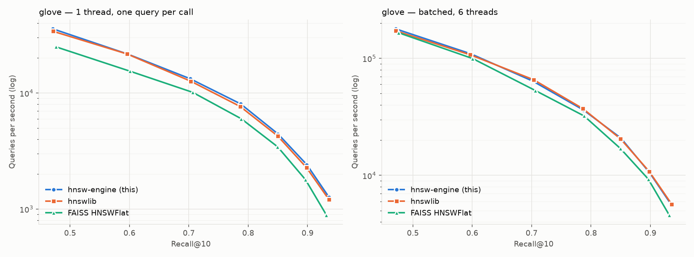
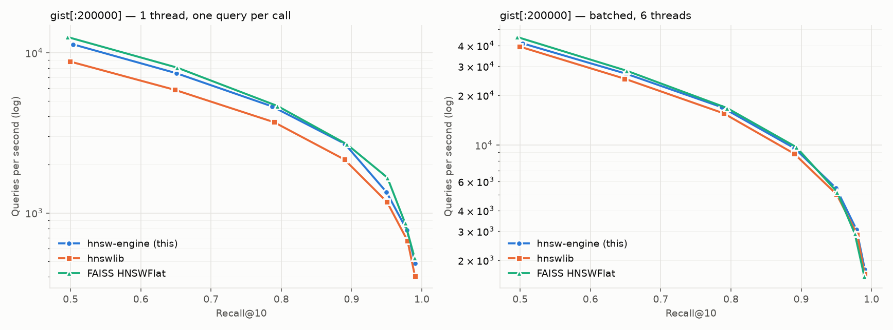

# Benchmarks

All numbers in this document were produced by `scripts/run_all_benchmarks.sh`
and are rendered from the CSVs in `bench/results/` by `bench/python/report.py`
(raw rows, plots and the generated `summary.md` live there). Nothing here was
typed in by hand.

## Data

The real [ann-benchmarks](https://github.com/erikbern/ann-benchmarks) HDF5
files, downloaded and converted by `scripts/fetch_data.py` (SHA-256 printed on
download):

| dataset | dim | base | queries | metric | ground truth |
|---|---:|---:|---:|---|---|
| SIFT-1M | 128 | 1,000,000 | 10,000 | L2 | provided top-100 |
| GloVe-100 | 100 | 1,183,514 | 10,000 | cosine (angular) | provided top-100 |
| GIST-1M | 960 | 200,000 of 1,000,000 | 1,000 | L2 | recomputed exactly for the subset (NumPy) |

GIST runs on its first 200k vectors (`GIST_SUBSET`) so three 960-d indexes fit
comfortably in 16 GB of RAM; set `GIST_SUBSET=0` on a larger machine.

### Earlier synthetic run

Before the real files were reachable, the pipeline was developed and run on
synthetic stand-ins of the same shapes (`--synthetic`, Gaussian mixtures on
low-dimensional subspaces) on a 4-core Intel Xeon cloud VM with AVX-512. Those
raw CSVs and plots are kept as `bench/results/synth-*` for reference but are not
used in the tables below. One observation from that run, a slightly lower
high-recall ceiling than hnswlib on synthetic SIFT, does **not** reproduce on
real SIFT-1M (max recall 0.9993 vs hnswlib 0.9992).

## Setup

<!-- env:begin -->
```
commit: b45cca4a47536ba9bf56b9fbfa9badb129eb0758
date: 2026-10-09T16:00Z
cpu: 13th Gen Intel(R) Core(TM) i7-13800H
cores: 20 (threads used: 6)
memory: 15 GB
os: Linux 6.18.40.1-microsoft-standard-WSL2 x86_64
rss_growth: proc
compiler: c++ (Ubuntu 13.3.0-6ubuntu2~24.04.1) 13.3.0
python: Python 3.12.3
hnswlib: 0.8.0
faiss-cpu: 1.15.1
numpy: 2.5.3
engine simd: avx2
```
<!-- env:end -->

* Hardware and software versions are in the block above
  (`bench/results/environment.txt`). The CPU has 4 performance and 6
  efficiency cores; every multi-threaded step used **4 threads** (the
  performance cores) for all three libraries.
* Engine built with `-O3` and `-mcpu=native` (`bench` preset for the C++
  harness, `HNSW_NATIVE=ON pip install .` for the Python package), using its
  NEON kernels. hnswlib 0.8.0 is an sdist compiled locally with its default
  flags; its hand-written SIMD kernels are x86-only (SSE/AVX), so on ARM it
  runs its generic distance code. faiss-cpu 1.13.0 is the PyPI wheel (newest
  available for the Python 3.9 used here) and has NEON kernels, so **FAISS is
  the like-for-like comparison on this machine**.
* All libraries: `M = 16`, `ef_construction = 200`, `k = 10`, same metric
  (FAISS cosine = inner product on normalized vectors, which is how the other
  two implement cosine internally), same thread count (FAISS via
  `omp_set_num_threads`).
* Every library runs in its own subprocess (`compare.py`), so peak memory is
  isolated per library.
* Search comparisons use a pre-built index (standard ann-benchmarks method):
  build once, then sweep `ef_search ∈ {10, 20, 40, 80, 160, 320, 640}`.
* Two query modes: **single**: one thread, one query per Python call
  (per-query latency p50/p95/p99, includes the Python call overhead for every
  library alike); **batch**: all queries in one call on 4 threads
  (throughput). Each point: warm-up pass, then 3 repetitions, median by QPS.
* Recall@10 = |returned ∩ true top-10| / 10, averaged over queries (id
  overlap). SIFT vectors are integer-valued, so exact distance ties occur and
  a correct neighbour can occasionally count as a miss; this is why brute
  force scores 0.9991 rather than 1.0 against the provided ground truth.
* Build metrics: wall time with 4 threads and with 1 thread (SIFT), peak RSS
  of the process and serialized index size. The "RSS growth" column is shown
  as "—" for this run: on macOS the harness at this commit recorded peak
  instead of current RSS, which makes growth meaningless (fixed for future
  runs; `compare.py` now asks `ps`).
* Throughput on a laptop depends on thermals and background load; the run
  was made plugged in, with other applications closed.

## Results

<!-- results:begin -->




### gist

n=200000, dim=960, metric=l2, M=16, ef_construction=200, k=10, threads=6

**Best QPS at recall@10 ≥ threshold (single-thread, one query per call)**

| library | ≥0.90 | ≥0.95 | ≥0.99 |
|---|---:|---:|---:|
| hnsw-engine (this) | 1,348 | 782 | 486 |
| hnswlib | 1,171 | 1,171 | 404 |
| FAISS HNSWFlat | 1,660 | 1,660 | — |

**Best QPS at recall@10 ≥ threshold (batched, multi-thread)**

| library | ≥0.90 | ≥0.95 | ≥0.99 |
|---|---:|---:|---:|
| hnsw-engine (this) | 5,462 | 3,060 | 1,759 |
| hnswlib | 5,013 | 5,013 | 1,650 |
| FAISS HNSWFlat | 5,185 | 5,185 | — |

**Recall / QPS / latency per ef (single-thread)**

| library | ef | recall@10 | QPS | p50 µs | p99 µs |
|---|---:|---:|---:|---:|---:|
| hnsw-engine (this) | 10 | 0.5037 | 11,245 | 86 | 179 |
| hnsw-engine (this) | 20 | 0.6504 | 7,438 | 130 | 252 |
| hnsw-engine (this) | 40 | 0.7869 | 4,616 | 216 | 387 |
| hnsw-engine (this) | 80 | 0.8903 | 2,700 | 371 | 629 |
| hnsw-engine (this) | 160 | 0.9497 | 1,348 | 759 | 1,150 |
| hnsw-engine (this) | 320 | 0.9788 | 782 | 1,317 | 1,755 |
| hnsw-engine (this) | 640 | 0.9905 | 486 | 2,089 | 3,245 |
| hnswlib | 10 | 0.4992 | 8,792 | 106 | 218 |
| hnswlib | 20 | 0.6485 | 5,852 | 165 | 316 |
| hnswlib | 40 | 0.7896 | 3,681 | 271 | 425 |
| hnswlib | 80 | 0.8898 | 2,154 | 466 | 713 |
| hnswlib | 160 | 0.9504 | 1,171 | 886 | 1,200 |
| hnswlib | 320 | 0.9797 | 670 | 1,542 | 2,104 |
| hnswlib | 640 | 0.9902 | 404 | 2,546 | 3,670 |
| FAISS HNSWFlat | 10 | 0.4957 | 12,498 | 76 | 157 |
| FAISS HNSWFlat | 20 | 0.6514 | 8,062 | 119 | 254 |
| FAISS HNSWFlat | 40 | 0.7943 | 4,648 | 212 | 350 |
| FAISS HNSWFlat | 80 | 0.8928 | 2,688 | 376 | 524 |
| FAISS HNSWFlat | 160 | 0.9510 | 1,660 | 607 | 923 |
| FAISS HNSWFlat | 320 | 0.9762 | 864 | 1,150 | 2,356 |
| FAISS HNSWFlat | 640 | 0.9897 | 525 | 1,934 | 2,818 |

**Build**

| library | version | build s (N threads) | build s (1 thread) | index file MB | RSS growth MB | peak RSS MB |
|---|---|---:|---:|---:|---:|---:|
| hnsw-engine (this) | 0.1.0 | 38.5 | — | 760 | 774 | 3073 |
| hnswlib | 0.8.0 | 41.2 | — | 761 | 786 | 3073 |
| FAISS HNSWFlat | 1.15.1 | 41.9 | — | 760 | 778 | 3073 |

### glove

n=1183514, dim=100, metric=cosine, M=16, ef_construction=200, k=10, threads=6

**Best QPS at recall@10 ≥ threshold (single-thread, one query per call)**

| library | ≥0.90 | ≥0.95 | ≥0.99 |
|---|---:|---:|---:|
| hnsw-engine (this) | 1,268 | — | — |
| hnswlib | 1,211 | — | — |
| FAISS HNSWFlat | 890 | — | — |

**Best QPS at recall@10 ≥ threshold (batched, multi-thread)**

| library | ≥0.90 | ≥0.95 | ≥0.99 |
|---|---:|---:|---:|
| hnsw-engine (this) | 5,537 | — | — |
| hnswlib | 5,675 | — | — |
| FAISS HNSWFlat | 4,586 | — | — |

**Recall / QPS / latency per ef (single-thread)**

| library | ef | recall@10 | QPS | p50 µs | p99 µs |
|---|---:|---:|---:|---:|---:|
| hnsw-engine (this) | 10 | 0.4708 | 35,664 | 26 | 56 |
| hnsw-engine (this) | 20 | 0.5976 | 21,572 | 42 | 93 |
| hnsw-engine (this) | 40 | 0.7022 | 13,264 | 69 | 137 |
| hnsw-engine (this) | 80 | 0.7872 | 8,059 | 120 | 228 |
| hnsw-engine (this) | 160 | 0.8502 | 4,440 | 222 | 415 |
| hnsw-engine (this) | 320 | 0.8987 | 2,416 | 415 | 660 |
| hnsw-engine (this) | 640 | 0.9361 | 1,268 | 799 | 1,175 |
| hnswlib | 10 | 0.4714 | 33,952 | 27 | 58 |
| hnswlib | 20 | 0.5961 | 21,659 | 43 | 89 |
| hnswlib | 40 | 0.7034 | 12,620 | 73 | 154 |
| hnswlib | 80 | 0.7863 | 7,663 | 125 | 238 |
| hnswlib | 160 | 0.8498 | 4,260 | 230 | 394 |
| hnswlib | 320 | 0.8981 | 2,283 | 438 | 738 |
| hnswlib | 640 | 0.9359 | 1,211 | 836 | 1,268 |
| FAISS HNSWFlat | 10 | 0.4759 | 24,978 | 37 | 84 |
| FAISS HNSWFlat | 20 | 0.6008 | 15,409 | 60 | 132 |
| FAISS HNSWFlat | 40 | 0.7065 | 10,130 | 92 | 186 |
| FAISS HNSWFlat | 80 | 0.7883 | 6,002 | 159 | 296 |
| FAISS HNSWFlat | 160 | 0.8496 | 3,442 | 284 | 488 |
| FAISS HNSWFlat | 320 | 0.8964 | 1,797 | 552 | 878 |
| FAISS HNSWFlat | 640 | 0.9317 | 890 | 1,124 | 1,598 |

**Build**

| library | version | build s (N threads) | build s (1 thread) | index file MB | RSS growth MB | peak RSS MB |
|---|---|---:|---:|---:|---:|---:|
| hnsw-engine (this) | 0.1.0 | 69.6 | — | 671 | 742 | 1241 |
| hnswlib | 0.8.0 | 80.8 | — | 619 | 741 | 1250 |
| FAISS HNSWFlat | 1.15.1 | 88.3 | — | 614 | 654 | 1603 |

### sift

n=1000000, dim=128, metric=l2, M=16, ef_construction=200, k=10, threads=6

**Best QPS at recall@10 ≥ threshold (single-thread, one query per call)**

| library | ≥0.90 | ≥0.95 | ≥0.99 |
|---|---:|---:|---:|
| hnsw-engine (this) | 15,660 | 9,200 | 5,137 |
| hnswlib | 14,294 | 8,117 | 4,624 |
| FAISS HNSWFlat | 12,230 | 6,900 | 3,786 |

**Best QPS at recall@10 ≥ threshold (batched, multi-thread)**

| library | ≥0.90 | ≥0.95 | ≥0.99 |
|---|---:|---:|---:|
| hnsw-engine (this) | 80,811 | 45,430 | 24,450 |
| hnswlib | 71,714 | 40,403 | 20,586 |
| FAISS HNSWFlat | 66,652 | 35,090 | 19,554 |

**Recall / QPS / latency per ef (single-thread)**

| library | ef | recall@10 | QPS | p50 µs | p99 µs |
|---|---:|---:|---:|---:|---:|
| hnsw-engine (this) | 10 | 0.7077 | 39,730 | 24 | 48 |
| hnsw-engine (this) | 20 | 0.8387 | 25,880 | 37 | 82 |
| hnsw-engine (this) | 40 | 0.9271 | 15,660 | 62 | 110 |
| hnsw-engine (this) | 80 | 0.9746 | 9,200 | 109 | 176 |
| hnsw-engine (this) | 160 | 0.9931 | 5,137 | 196 | 346 |
| hnsw-engine (this) | 320 | 0.9983 | 2,796 | 363 | 556 |
| hnsw-engine (this) | 640 | 0.9993 | 1,527 | 665 | 1,051 |
| hnswlib | 10 | 0.7082 | 34,986 | 27 | 54 |
| hnswlib | 20 | 0.8389 | 23,537 | 42 | 73 |
| hnswlib | 40 | 0.9275 | 14,294 | 70 | 111 |
| hnswlib | 80 | 0.9747 | 8,117 | 124 | 184 |
| hnswlib | 160 | 0.9931 | 4,624 | 221 | 316 |
| hnswlib | 320 | 0.9983 | 2,507 | 409 | 571 |
| hnswlib | 640 | 0.9992 | 1,363 | 753 | 1,070 |
| FAISS HNSWFlat | 10 | 0.7157 | 30,548 | 31 | 69 |
| FAISS HNSWFlat | 20 | 0.8457 | 20,461 | 47 | 90 |
| FAISS HNSWFlat | 40 | 0.9337 | 12,230 | 80 | 134 |
| FAISS HNSWFlat | 80 | 0.9775 | 6,900 | 142 | 269 |
| FAISS HNSWFlat | 160 | 0.9936 | 3,786 | 265 | 445 |
| FAISS HNSWFlat | 320 | 0.9982 | 1,949 | 519 | 778 |
| FAISS HNSWFlat | 640 | 0.9992 | 975 | 1,041 | 1,511 |

**Build**

| library | version | build s (N threads) | build s (1 thread) | index file MB | RSS growth MB | peak RSS MB |
|---|---|---:|---:|---:|---:|---:|
| hnsw-engine (this) | 0.1.0 | 45.2 | 211.6 | 628 | 632 | 1226 |
| hnswlib | 0.8.0 | 57.2 | 263.9 | 630 | 728 | 1293 |
| FAISS HNSWFlat | 1.15.1 | 67.0 | 320.1 | 626 | 640 | 1193 |

### Ablation (bench_main, engine only)

| label | isa | prefetch | search_threads | ef | recall | qps | p50_us | p99_us |
|---|---|---|---|---|---|---|---|---|
| 1 scalar kernels (no prefetch) | scalar | 0 | 1 | 64 | 0.96337 | 4287.5 | 233.7 | 405.3 |
| 2 +AVX2 kernels | avx2 | 0 | 1 | 64 | 0.96337 | 10007.1 | 98.6 | 162.8 |
| 3 +prefetch | avx2 | 1 | 1 | 64 | 0.96337 | 12078.1 | 82.7 | 143.2 |
| 5 +6 search threads | avx2 | 1 | 6 | 64 | 0.96337 | 55904.8 | nan | nan |

### Build thread scaling (bench_main, engine only)

| build_threads | n | build_s | ef | recall |
|---|---|---|---|---|
| 1 | 200000 | 28.827 | 64 | 0.98110 |
| 2 | 200000 | 14.240 | 64 | 0.98100 |
| 4 | 200000 | 8.055 | 64 | 0.98060 |

Notes on the tables:

* Ablation and scaling rows come from the C++ harness (`bench_main`). The ablation loads one
  pre-built index, so every row searches the identical graph (identical recall); the last row is
  batched, so it has no per-query latency.
* gist peak RSS is dominated by loading the 960-d dataset in each worker, so it is the same
  for all three libraries; compare the RSS-growth column instead.
* Brute force on sift (1,000 queries) reaches recall 0.99910 against the provided ground truth (`bruteforce.csv`), validating the harness. Anything below 1.0 comes from exact distance ties (SIFT vectors are integer-valued, so neighbours at rank 10 and 11 can be equidistant and either is correct); recall here counts id overlap, as the spec defines it.

### Filtered search (engine, sift[:200000], random allow-lists)

| allowed | ef | recall@10 | QPS | filter violations |
|---:|---:|---:|---:|---:|
| 1% | 40 | 0.9990 | 2,138 | 0 |
| 1% | 80 | 0.9990 | 1,255 | 0 |
| 1% | 160 | 0.9990 | 684 | 0 |
| 1% | 320 | 0.9990 | 373 | 0 |
| 10% | 40 | 0.9982 | 16,717 | 0 |
| 10% | 80 | 0.9997 | 9,086 | 0 |
| 10% | 160 | 0.9998 | 4,862 | 0 |
| 10% | 320 | 0.9998 | 2,753 | 0 |
| 50% | 40 | 0.9817 | 52,243 | 0 |
| 50% | 80 | 0.9966 | 31,712 | 0 |
| 50% | 160 | 0.9996 | 18,510 | 0 |
| 50% | 320 | 0.9998 | 10,074 | 0 |
| 90% | 40 | 0.9601 | 91,738 | 0 |
| 90% | 80 | 0.9901 | 54,622 | 0 |
| 90% | 160 | 0.9978 | 26,972 | 0 |
| 90% | 320 | 0.9995 | 16,795 | 0 |

Every returned id satisfied the filter. Recall stays high at low selectivity because the search
keeps exploring until it has `ef` eligible results; the cost is throughput.

### Kernel microbenchmarks (Google Benchmark, ns per call)

| dim | scalar L2 | AVX2 L2 | scalar dot | AVX2 dot |
|---:|---:|---:|---:|---:|
| 16 | 3.6 | 3.0 | 3.6 | 2.6 |
| 100 | 24.5 | 5.5 | 23.2 | 4.9 |
| 128 | 33.8 | 5.8 | 30.9 | 5.2 |
| 384 | 125.6 | 15.2 | 124.6 | 11.6 |
| 768 | 292.7 | 27.8 | 280.9 | 21.9 |
| 960 | 379.7 | 32.5 | 362.3 | 27.0 |
| 1024 | 417.0 | 35.0 | 383.3 | 29.6 |

## Resume-ready summary (measured; SIFT-1M / GIST-1M)

* Built an HNSW vector search engine from scratch in C++20 (Malkov & Yashunin, Algorithms 1–5) with AVX2/AVX-512/NEON kernels and runtime CPU dispatch: **5.8× faster L2 kernel** (AVX2 vs scalar, d = 128) and **2.8× single-thread QPS from SIMD + prefetching** at identical recall (1M × 128).
* 1,000,000 × 128, l2, recall@10 ≥ 0.95, single thread: **9,200 QPS vs hnswlib 8,117 (+13%) and FAISS HNSWFlat 6,900 (+33%)**. Slower than FAISS HNSWFlat on 200,000 × 960, l2 (-53% at recall ≥ 0.95). 
* Parallel build scales 3.6× on 4 threads (200,000 vectors: 28.8 s → 8.1 s; recall@10 at ef=64 0.9811 → 0.9806). 1M-vector build in 45 s on 4 threads (hnswlib 57 s, FAISS 67 s) at the same index size.
* Memory-mapped, checksummed on-disk format whose loader rejects every truncated or bit-flipped file in fuzz tests; ASan/UBSan- and TSan-clean; GoogleTest + pytest suites; pybind11 package that releases the GIL and matches the C++ results exactly.
<!-- results:end -->
