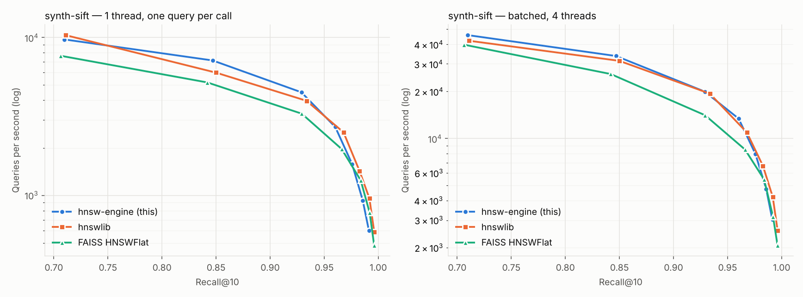
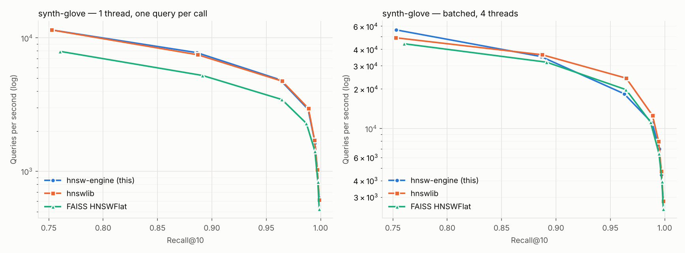
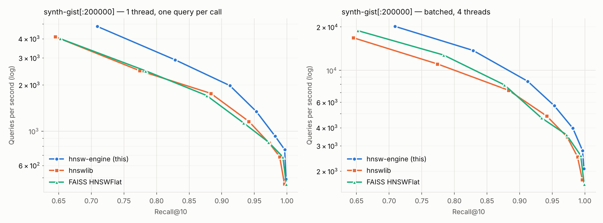

# Benchmarks

All numbers in this document were produced by `scripts/run_all_benchmarks.sh
--synthetic` and are copied from the CSVs in `bench/results/` (raw rows,
plots and the generated `summary.md` live there). Nothing here was typed in
by hand from memory.

## Read this first: the data is synthetic

The benchmark machine could not reach ann-benchmarks.com (blocked by its
network policy), so the real SIFT-1M / GloVe-100 / GIST-1M HDF5 files were not
available. `scripts/fetch_data.py --synthetic` generates stand-ins with the
**same dimension, base size, query count and metric**:

| name | dim | base | queries | metric | real counterpart |
|---|---:|---:|---:|---|---|
| synth-sift | 128 | 1,000,000 | 10,000 | L2 | SIFT-1M |
| synth-glove | 100 | 1,183,514 | 10,000 | cosine | GloVe-100 (angular) |
| synth-gist | 960 | 1,000,000 (200,000 used) | 1,000 | L2 | GIST-1M |

Vectors are drawn from a 256-component Gaussian mixture in which every
component lives on its own random 24-dimensional subspace plus small isotropic
noise (low intrinsic dimension, like real descriptors/embeddings). Exact
top-100 ground truth is computed with NumPy (float32 shortlist, float64
re-rank) — independently of the engine. Absolute recall/QPS on real data will
differ; the *relative* comparison between libraries under identical
conditions is the point of these numbers. Run the script without
`--synthetic` on a networked machine to benchmark the real files.

## Setup

<!-- env:begin -->
```
commit: ca19d788e7c19331ca0aab545fc952e5e928d17f
date: 2026-10-07T19:24Z
cpu: Intel(R) Xeon(R) Processor @ 2.80GHz
cores: 4 (threads used: 4)
memory: 15 GB
os: Linux 6.18.44-fc-v77 x86_64
compiler: c++ (Ubuntu 13.3.0-6ubuntu2~24.04.1) 13.3.0
python: Python 3.13.16
hnswlib: 0.8.0
faiss-cpu: 1.15.1
numpy: 2.5.3
engine simd: avx512
```
<!-- env:end -->

* Engine built with `-O3 -march=native` (`bench` preset for the C++ harness,
  `HNSW_NATIVE=ON pip install .` for the Python package). hnswlib 0.8.0 is
  distributed as an sdist and was compiled locally with its default
  `-O3 -march=native`. faiss-cpu 1.15.1 is the PyPI wheel, which dispatches at
  runtime to its AVX-512 build on this CPU (`get_compile_options()` →
  `OPTIMIZE DD AVX2 AVX512`).
* All libraries: `M = 16`, `ef_construction = 200`, `k = 10`, same metric
  (FAISS cosine = inner product on normalized vectors, which is how the other
  two implement cosine internally), same thread count (4; FAISS via
  `omp_set_num_threads`).
* Every library runs in its own subprocess (`compare.py`), so peak RSS is
  isolated per library.
* Search comparisons use a pre-built index (standard ann-benchmarks method):
  build once, then sweep `ef_search ∈ {10, 20, 40, 80, 160, 320, 640}`.
* Two query modes: **single** — one thread, one query per Python call
  (per-query latency p50/p95/p99, includes the Python call overhead for every
  library alike); **batch** — all queries in one call on 4 threads
  (throughput). Each point: warm-up pass, then 3 repetitions, median by QPS.
* Recall@10 = |returned ∩ true top-10| / 10, averaged over queries (id
  overlap; with exact distance ties a correct answer could count as a miss —
  ties do not occur in this continuous synthetic data).
* Build metrics: wall time with 4 threads and with 1 thread (synth-sift),
  RSS growth during the build, peak RSS of the process, serialized file size.
* GIST is run on a 200k subset (`GIST_SUBSET`, ground truth recomputed
  exactly for the subset) to keep three 960-d builds within the 15 GB / 4-core
  budget of the benchmark machine.

## Results

<!-- results:begin -->




### synth-gist

n=200000, dim=960, metric=l2, M=16, ef_construction=200, k=10, threads=4

**Best QPS at recall@10 ≥ threshold (single-thread, one query per call)**

| library | ≥0.90 | ≥0.95 | ≥0.99 |
|---|---:|---:|---:|
| hnsw-engine (this) | 1,982 | 1,344 | 760 |
| hnswlib | 1,159 | 838 | 454 |
| FAISS HNSWFlat | 1,132 | 850 | 681 |

**Best QPS at recall@10 ≥ threshold (batched, multi-thread)**

| library | ≥0.90 | ≥0.95 | ≥0.99 |
|---|---:|---:|---:|
| hnsw-engine (this) | 8,389 | 5,687 | 2,780 |
| hnswlib | 4,822 | 3,459 | 1,748 |
| FAISS HNSWFlat | 4,678 | 3,580 | 2,572 |

**Recall / QPS / latency per ef (single-thread)**

| library | ef | recall@10 | QPS | p50 µs | p99 µs |
|---|---:|---:|---:|---:|---:|
| hnsw-engine (this) | 10 | 0.7090 | 4,809 | 192 | 428 |
| hnsw-engine (this) | 20 | 0.8285 | 2,913 | 307 | 797 |
| hnsw-engine (this) | 40 | 0.9124 | 1,982 | 455 | 1,189 |
| hnsw-engine (this) | 80 | 0.9530 | 1,344 | 687 | 1,816 |
| hnsw-engine (this) | 160 | 0.9816 | 931 | 1,009 | 2,410 |
| hnsw-engine (this) | 320 | 0.9964 | 760 | 1,216 | 2,988 |
| hnsw-engine (this) | 640 | 0.9985 | 488 | 1,848 | 5,161 |
| hnswlib | 10 | 0.6448 | 4,116 | 227 | 508 |
| hnswlib | 20 | 0.7740 | 2,478 | 349 | 1,624 |
| hnswlib | 40 | 0.8831 | 1,764 | 523 | 1,203 |
| hnswlib | 80 | 0.9415 | 1,159 | 795 | 2,097 |
| hnswlib | 160 | 0.9727 | 838 | 1,077 | 3,278 |
| hnswlib | 320 | 0.9887 | 683 | 1,338 | 3,402 |
| hnswlib | 640 | 0.9961 | 454 | 2,003 | 5,527 |
| FAISS HNSWFlat | 10 | 0.6520 | 4,007 | 222 | 509 |
| FAISS HNSWFlat | 20 | 0.7834 | 2,470 | 333 | 1,049 |
| FAISS HNSWFlat | 40 | 0.8766 | 1,710 | 540 | 1,172 |
| FAISS HNSWFlat | 80 | 0.9335 | 1,132 | 828 | 1,859 |
| FAISS HNSWFlat | 160 | 0.9717 | 850 | 1,096 | 2,846 |
| FAISS HNSWFlat | 320 | 0.9936 | 681 | 1,360 | 3,493 |
| FAISS HNSWFlat | 640 | 0.9989 | 453 | 1,982 | 5,269 |

**Build**

| library | version | build s (N threads) | build s (1 thread) | index file MB | RSS growth MB | peak RSS MB |
|---|---|---:|---:|---:|---:|---:|
| hnsw-engine (this) | 0.1.0 | 51.1 | — | 760 | 773 | 3068 |
| hnswlib | 0.8.0 | 62.3 | — | 761 | 785 | 3068 |
| FAISS HNSWFlat | 1.15.1 | 59.4 | — | 760 | 777 | 3068 |

### synth-glove

n=1183514, dim=100, metric=cosine, M=16, ef_construction=200, k=10, threads=4

**Best QPS at recall@10 ≥ threshold (single-thread, one query per call)**

| library | ≥0.90 | ≥0.95 | ≥0.99 |
|---|---:|---:|---:|
| hnsw-engine (this) | 4,854 | 4,854 | 1,633 |
| hnswlib | 4,740 | 4,740 | 1,715 |
| FAISS HNSWFlat | 3,451 | 3,451 | 1,418 |

**Best QPS at recall@10 ≥ threshold (batched, multi-thread)**

| library | ≥0.90 | ≥0.95 | ≥0.99 |
|---|---:|---:|---:|
| hnsw-engine (this) | 18,341 | 18,341 | 6,979 |
| hnswlib | 24,107 | 24,107 | 7,936 |
| FAISS HNSWFlat | 19,720 | 19,720 | 6,438 |

**Recall / QPS / latency per ef (single-thread)**

| library | ef | recall@10 | QPS | p50 µs | p99 µs |
|---|---:|---:|---:|---:|---:|
| hnsw-engine (this) | 10 | 0.7532 | 11,431 | 75 | 197 |
| hnsw-engine (this) | 20 | 0.8862 | 7,744 | 113 | 263 |
| hnsw-engine (this) | 40 | 0.9627 | 4,854 | 186 | 382 |
| hnsw-engine (this) | 80 | 0.9885 | 2,913 | 320 | 647 |
| hnsw-engine (this) | 160 | 0.9949 | 1,633 | 575 | 1,082 |
| hnsw-engine (this) | 320 | 0.9970 | 1,034 | 928 | 1,688 |
| hnsw-engine (this) | 640 | 0.9987 | 634 | 1,533 | 2,928 |
| hnswlib | 10 | 0.7526 | 11,452 | 74 | 201 |
| hnswlib | 20 | 0.8871 | 7,460 | 116 | 273 |
| hnswlib | 40 | 0.9646 | 4,740 | 187 | 405 |
| hnswlib | 80 | 0.9888 | 2,964 | 316 | 636 |
| hnswlib | 160 | 0.9944 | 1,715 | 557 | 1,023 |
| hnswlib | 320 | 0.9969 | 1,030 | 932 | 1,729 |
| hnswlib | 640 | 0.9987 | 609 | 1,568 | 3,138 |
| FAISS HNSWFlat | 10 | 0.7603 | 7,916 | 110 | 319 |
| FAISS HNSWFlat | 20 | 0.8913 | 5,226 | 171 | 428 |
| FAISS HNSWFlat | 40 | 0.9644 | 3,451 | 266 | 566 |
| FAISS HNSWFlat | 80 | 0.9869 | 2,288 | 412 | 784 |
| FAISS HNSWFlat | 160 | 0.9947 | 1,418 | 679 | 1,180 |
| FAISS HNSWFlat | 320 | 0.9975 | 836 | 1,157 | 2,131 |
| FAISS HNSWFlat | 640 | 0.9987 | 524 | 1,860 | 3,328 |

**Build**

| library | version | build s (N threads) | build s (1 thread) | index file MB | RSS growth MB | peak RSS MB |
|---|---|---:|---:|---:|---:|---:|
| hnsw-engine (this) | 0.1.0 | 163.0 | — | 671 | 737 | 1237 |
| hnswlib | 0.8.0 | 167.4 | — | 619 | 735 | 1244 |
| FAISS HNSWFlat | 1.15.1 | 214.6 | — | 614 | 649 | 1593 |

### synth-sift

n=1000000, dim=128, metric=l2, M=16, ef_construction=200, k=10, threads=4

**Best QPS at recall@10 ≥ threshold (single-thread, one query per call)**

| library | ≥0.90 | ≥0.95 | ≥0.99 |
|---|---:|---:|---:|
| hnsw-engine (this) | 4,496 | 2,708 | 598 |
| hnswlib | 3,972 | 2,508 | 956 |
| FAISS HNSWFlat | 3,291 | 1,966 | 775 |

**Best QPS at recall@10 ≥ threshold (batched, multi-thread)**

| library | ≥0.90 | ≥0.95 | ≥0.99 |
|---|---:|---:|---:|
| hnsw-engine (this) | 19,917 | 13,381 | 3,034 |
| hnswlib | 19,327 | 10,911 | 4,217 |
| FAISS HNSWFlat | 14,063 | 8,493 | 3,155 |

**Recall / QPS / latency per ef (single-thread)**

| library | ef | recall@10 | QPS | p50 µs | p99 µs |
|---|---:|---:|---:|---:|---:|
| hnsw-engine (this) | 10 | 0.7098 | 9,713 | 89 | 258 |
| hnsw-engine (this) | 20 | 0.8469 | 7,149 | 122 | 309 |
| hnsw-engine (this) | 40 | 0.9289 | 4,496 | 198 | 469 |
| hnsw-engine (this) | 80 | 0.9602 | 2,708 | 345 | 712 |
| hnsw-engine (this) | 160 | 0.9758 | 1,579 | 588 | 1,255 |
| hnsw-engine (this) | 320 | 0.9857 | 924 | 1,003 | 2,374 |
| hnsw-engine (this) | 640 | 0.9913 | 598 | 1,586 | 3,225 |
| hnswlib | 10 | 0.7107 | 10,344 | 86 | 204 |
| hnswlib | 20 | 0.8499 | 5,988 | 144 | 364 |
| hnswlib | 40 | 0.9336 | 3,972 | 225 | 549 |
| hnswlib | 80 | 0.9678 | 2,508 | 374 | 729 |
| hnswlib | 160 | 0.9827 | 1,423 | 656 | 1,383 |
| hnswlib | 320 | 0.9918 | 956 | 1,004 | 2,003 |
| hnswlib | 640 | 0.9962 | 587 | 1,649 | 3,322 |
| FAISS HNSWFlat | 10 | 0.7061 | 7,658 | 106 | 515 |
| FAISS HNSWFlat | 20 | 0.8419 | 5,189 | 169 | 451 |
| FAISS HNSWFlat | 40 | 0.9292 | 3,291 | 277 | 609 |
| FAISS HNSWFlat | 80 | 0.9661 | 1,966 | 471 | 1,033 |
| FAISS HNSWFlat | 160 | 0.9838 | 1,244 | 756 | 1,715 |
| FAISS HNSWFlat | 320 | 0.9920 | 775 | 1,230 | 2,571 |
| FAISS HNSWFlat | 640 | 0.9962 | 483 | 2,002 | 3,783 |

**Build**

| library | version | build s (N threads) | build s (1 thread) | index file MB | RSS growth MB | peak RSS MB |
|---|---|---:|---:|---:|---:|---:|
| hnsw-engine (this) | 0.1.0 | 132.4 | 570.2 | 628 | 628 | 1222 |
| hnswlib | 0.8.0 | 171.0 | 722.1 | 630 | 723 | 1289 |
| FAISS HNSWFlat | 1.15.1 | 195.7 | 790.6 | 626 | 634 | 1187 |

### Ablation (bench_main, engine only)

| label | isa | prefetch | search_threads | ef | recall | qps | p50_us | p99_us |
|---|---|---|---|---|---|---|---|---|
| 1 scalar kernels (no prefetch) | scalar | 0 | 1 | 64 | 0.95275 | 1374.8 | 701.4 | 1280.8 |
| 2 +AVX2 kernels | avx2 | 0 | 1 | 64 | 0.95275 | 2337.2 | 374.9 | 878.9 |
| 3 +prefetch | avx2 | 1 | 1 | 64 | 0.95275 | 3362.8 | 274.1 | 620.4 |
| 4 +AVX-512 kernels | avx512 | 1 | 1 | 64 | 0.95275 | 3060.2 | 309.5 | 624.3 |
| 5 +4 search threads | avx512 | 1 | 4 | 64 | 0.95275 | 13080.1 | nan | nan |

### Build thread scaling (bench_main, engine only)

| build_threads | n | build_s | ef | recall |
|---|---|---|---|---|
| 1 | 200000 | 66.995 | 64 | 0.99450 |
| 2 | 200000 | 30.973 | 64 | 0.99450 |
| 4 | 200000 | 16.823 | 64 | 0.99440 |

Notes on the tables:

* Ablation and scaling rows come from the C++ harness (`bench_main`). The ablation loads one
  pre-built index, so every row searches the identical graph (identical recall); the last row is
  batched, so it has no per-query latency.
* synth-gist peak RSS is dominated by loading the 960-d dataset in each worker, so it is the same
  for all three libraries; compare the RSS-growth column instead.
* Brute force on synth-sift (1,000 queries) reaches recall 1.00000 against the NumPy ground truth (`bruteforce.csv`), validating the harness.

### Filtered search (engine, synth-sift[:200000], random allow-lists)

| allowed | ef | recall@10 | QPS | filter violations |
|---:|---:|---:|---:|---:|
| 1% | 40 | 0.9999 | 783 | 0 |
| 1% | 80 | 1.0000 | 384 | 0 |
| 1% | 160 | 1.0000 | 180 | 0 |
| 1% | 320 | 1.0000 | 94 | 0 |
| 10% | 40 | 1.0000 | 8,299 | 0 |
| 10% | 80 | 1.0000 | 4,251 | 0 |
| 10% | 160 | 1.0000 | 2,199 | 0 |
| 10% | 320 | 1.0000 | 831 | 0 |
| 50% | 40 | 0.9947 | 16,787 | 0 |
| 50% | 80 | 0.9999 | 12,494 | 0 |
| 50% | 160 | 0.9999 | 8,248 | 0 |
| 50% | 320 | 0.9999 | 5,214 | 0 |
| 90% | 40 | 0.9837 | 21,718 | 0 |
| 90% | 80 | 0.9958 | 16,056 | 0 |
| 90% | 160 | 0.9999 | 11,242 | 0 |
| 90% | 320 | 0.9999 | 7,947 | 0 |

Every returned id satisfied the filter. Recall stays high at low selectivity because the search
keeps exploring until it has `ef` eligible results; the cost is throughput.

### Kernel microbenchmarks (Google Benchmark, ns per call)

| dim | scalar L2 | AVX2 L2 | AVX-512 L2 | scalar dot | AVX2 dot | AVX-512 dot |
|---:|---:|---:|---:|---:|---:|---:|
| 16 | 10.7 | 6.0 | 5.8 | 15.8 | 5.1 | 5.3 |
| 100 | 87.0 | 15.2 | 16.8 | 83.6 | 12.1 | 13.1 |
| 128 | 125.4 | 16.5 | 13.3 | 120.9 | 13.9 | 10.0 |
| 384 | 469.0 | 38.2 | 39.8 | 445.9 | 26.5 | 19.8 |
| 768 | 917.9 | 81.1 | 39.7 | 954.1 | 52.5 | 34.5 |
| 960 | 1211.7 | 77.3 | 55.7 | 1185.0 | 50.4 | 38.8 |
| 1024 | 1252.0 | 147.5 | 55.3 | 1261.1 | 71.3 | 47.8 |

### Run-to-run variance

The benchmark machine is a shared 4-core cloud VM. Comparing two complete runs of the pipeline
(same code for hnswlib/FAISS, recall identical to 4 decimals), single-thread QPS for the same
library moved by up to ~16% (hnswlib, synth-sift, recall ≥ 0.95: 2,167 vs 2,508) and batched
4-thread QPS by up to ~30%. Differences smaller than that are not meaningful on this machine.
For example, synth-glove batched at ef = 40:

| library | full run QPS | re-check QPS (`recheck_synth-glove_batch.csv`) |
|---|---:|---:|
| hnsw-engine | 18,341 | 24,393 |
| hnswlib | 24,107 | 22,572 |

Rerun on a dedicated host for publishable throughput numbers.

### Open item: high-recall ceiling on synth-sift

At ef = 640 the engine reaches lower recall than hnswlib on synth-sift (0.9913 vs 0.9962), although it matches or
exceeds hnswlib's recall on synth-glove and synth-gist. Two candidate causes were ruled out by an
A/B test on a 200k subset (no measurable recall change): passing only the closest node instead of
the whole result set W to the next layer, and skipping the heuristic when fewer than M candidates
exist (both hnswlib behaviours). The cause is still open.

## Resume-ready summary (measured; synthetic SIFT/GIST-shaped data)

* Built an HNSW vector search engine from scratch in C++20 (Malkov & Yashunin, Algorithms 1–5) with AVX2/AVX-512/NEON kernels and runtime CPU dispatch: **7.6× faster L2 kernel** (AVX2 vs scalar, d = 128) and **2.4× single-thread QPS from SIMD + prefetching** at identical recall (1M × 128).
* 1M × 128 L2, recall@10 ≥ 0.95, single thread: **2,708 QPS vs hnswlib 2,508 (+8%) and FAISS HNSWFlat 1,966 (+38%)** — on par with hnswlib within this VM’s ~16% run-to-run noise; 200k × 960: **+60% vs hnswlib**. Slower at recall ≥ 0.99 on 1M × 128 (-37% vs hnswlib).
* Parallel build scales 4.0× on 4 threads (200,000 vectors: 67.0 s → 16.8 s; recall@10 at ef=64 0.9945 → 0.9944). 1M-vector build in 132 s on 4 threads (hnswlib 171 s, FAISS 196 s) at the same index size.
* Memory-mapped, checksummed on-disk format whose loader rejects every truncated or bit-flipped file in fuzz tests; ASan/UBSan- and TSan-clean; GoogleTest + pytest suites; pybind11 package that releases the GIL and matches the C++ results exactly.
<!-- results:end -->
